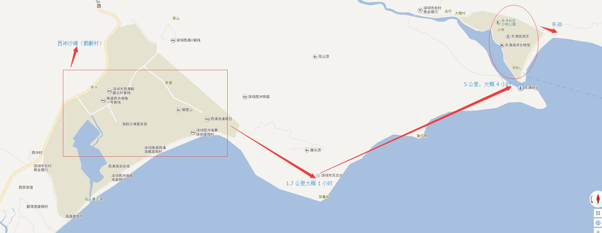

东西冲穿越
===

# 计划日程

## 方案汇总

<table> 
    <thead>
        <th>方案名</th>
        <th>特点</th>
        <th>价格</th>
    </thead>
    <tr>
        <td><a href="#p1">方案 1</a></td>
        <td>
            <ul>
            <li>需要自己准备帐篷,食材等</li>
            <li>最靠近大自然玩法</li>
            </ul>
        </td>
        <td>
           来回车费(50) + 所有准备(150) = 200 元/人
           (需要提前询问帐篷,购买食材等)   
        </td>
    </tr>
    <tr>
        <td><a href="#p2">方案 2</a></td>
        <td>
            <ul>
            <li>只要带钱就够了</li>
            <li>最轻松的玩法</li>
            </ul>
        </td>
        <td>
           来回车费(50) + 客栈(150/人) + 野炊(50/人) + (100)其他 = 350 元/人
           (可以准备食材)   
        </td>
    </tr>
    <tr>
        <td><a href="#p3">方案 3</a></td>
        <td>
            <ul>
            <li>满足各类人的需求</li>
            <li>最折腾的玩法</li>
            </ul>
        </td>
        <td>
           来回车费(50) + 住客栈(150/人) + 野炊(50/人) + (100)其他 = 350 元/人
            来回车费(50) + 野炊(50/人) + (100)其他 = 200 元/人
           (需要野营的自带帐篷)   
        </td>
    </tr>
</table>

<h2 id="p1">方案 1</h2>

### 2017-11-25
1. 早上 8:30 深圳北站集合
2. 理想状态 12:30 到南澳街道办（随便吃点 30 分钟，10*25）
3. 13：00 到沙滩 （每次 15元/人）
 
   ** ps : 如果出沙滩需要重新交费**
    
4. 先在沙滩上玩一会 （2 小时），可以坐水上摩托（20-30元人）到对面小岛玩

   ** ps:可以抓海参(看我们的运气了), 抓到了当晚餐 **
     
5. 大概 **3点** 开始穿越

    
    
6. 5:00 到达天文台下面小沙滩露营(也可继续往前,沿路有很多小沙滩),野炊

   ** ps : 所有装备都需准备,露营帐篷,食材等**
   
   ** ps : 基本炊具(小锅等),调理可以过去买,洗菜,烧水可以利用山泉**
    
7. 海边过夜

### 2017-11-26

1. 早上海边看日出,预计 1:00 以前到达东冲
2. 回家估计 5:00 ，大家可以一起吃晚饭,也可各自回家

<h2 id="p2">方案 2</h2>

### 2017-11-25
1. 早上 8:30 公司楼下集合
2. 下午 13:00 左右到了客栈大家可以随意吃点东西
3. **2点左右**愿意穿越的可以组织一起去穿越，不穿越的可以看看风景，玩玩游戏

4. 到晚上大家集合，可以在客栈或者沙滩烧烤，唱 K,玩游戏,一起嗨！！！

   ** ps : 请提前定好房间，节假日价格大概在（150-200）之间 **
   
   ** ps : 最好找有特色的客栈比如有休息室，台球房，可以烧烤做饭有 ktv 等。**    

### 2017-11-26
1. 早上去沙滩看日出,大概 5:00 起床 (去沙滩 15 元/人,过早 20 元/人)

   ** ps :  5:00 基本没有早餐卖**
   
2. 玩到 12:00 返回旅馆，吃饭回家
3. 原路返回大概 5:00 到家，可以一起吃晚饭也可随意

<h2 id="p3">方案 3</h2>
### 2017-11-25
1. 下午 13:00 到,不想露营的直接去客栈放东西
2. 15:00 在沙滩集合,玩到晚上在沙滩烧烤,玩耍,不露营的直接回客栈
3. 愿意露营的请注意安全

   ** ps: 帐篷等可以直接在沙滩租，也可以自己带 **

### 2017-11-26
1. 露营可以继续玩耍,不露营的可早起看日出

   ** ps: 大家也可约定一起去玩野外 cs 等 **
    
2. 玩到中午原路返回
3. 晚上可以一起吃饭或各自回家

# 路线
## 去程

这里统一包车一起去
(时间：3-4 小时）
** ps : 这里可以准备在车上的游戏，以帮助大家渡过车上漫长的时间**

## 回程

这里统一包车一起回
(时间：3-4 小时）
** ps : 这里可以准备在车上的游戏，以帮助大家渡过车上漫长的时间**

